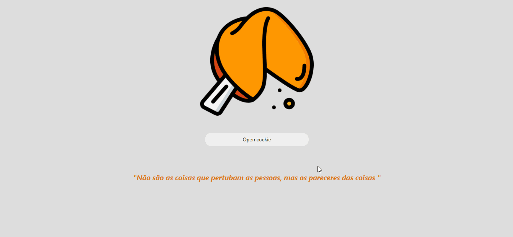

# Biscoito da sorte 🥠

>◾ Projeto Biscoito da sorte realizado em React.js.  
 Como funciona: 
 Clicamos no botão e ele gera uma frase aleatória do biscoito, contendo algumas opções.  
 ◾ Focando aprender e praticar conceitos e métodos de react e javascript;  
> Alguns conhecimentos aplicados nesse projeto:
Arrays e manipulação de seus elementos, class components, onclick, constructor.

### Tecnologias usadas:

 
 
 
  
  
   
    
    
    
    

## 🤝 Colaboradores

<a href="https://www.linkedin.com/in/marcusviniciusbeghelisantos/" target="_blank">Marcus Vinícius</a> 

